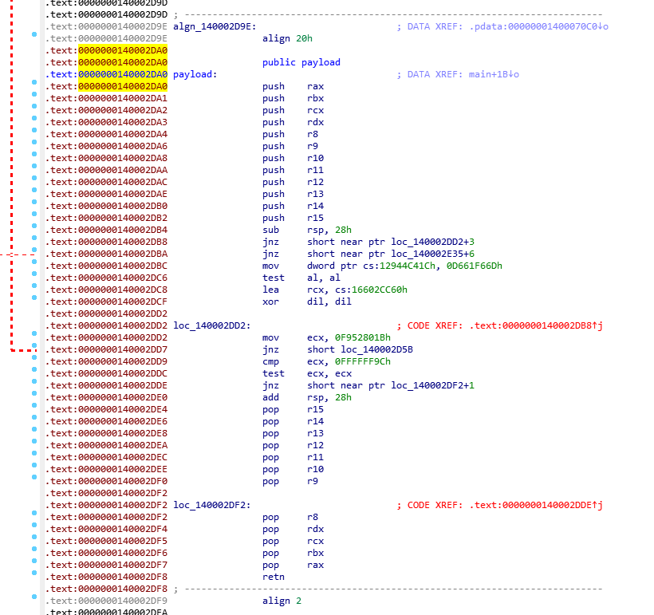

<div align="center">
  
  <h1>CODASM</h1>
  <br/>

  <p><i>CODASM allows you to encode arbitrary data into pseudo ASM instructions and compile them into the .text section of binaries.<br />Comes with 80-120% overhead (e.g. 380KB CS shellcode => 870KB CODASM payload).</i></p>
  <p><i>Written by <a href="https://github.com/molatho">Moritz Thomas</a> from the <a href="https://ares.nviso.eu/">ARES</a> team at <a href="https://www.nviso.eu/">NVISO</a>.</i></p>
  
  <br/>
  
</div>

## Table of Contents

- [Installation](#installation)
- [Usage](#usage)
- [Example](#example)
- [Concept](#concept)
- [Detection](#detection)
- [Contributing](#contributing)

## Installation

Simply clone the repo locally: `git clone https://github.com/NVISOsecurity/codasm`

No specific Python libs/dependencies required.

Supports MSVC & MINGW.

## Usage

```
usage: codasm.py [-h] -i INPUT [-oa OUT_ASM] [-ob OUT_BIN] [-oc OUT_C] [-op OUT_P] [--rng RNG] [-vbmin VAL_BYTES_MIN] [-vbmax VAL_BYTES_MAX] [-vbch VAL_BYTES_CHANCE] [-v]

CODASM encoding utility

options:
  -h, --help            show this help message and exit
  -i INPUT, --input INPUT
                        Path to the input file to encode as ASM/binary instructions
  -oa OUT_ASM, --out-asm OUT_ASM
                        Path to write the generated ASM instructions to
  -ob OUT_BIN, --out-bin OUT_BIN
                        Path to write the generated binary instructions to
  -oc OUT_C, --out-c OUT_C
                        Path to write the generated CODASM decoder to
  -op OUT_P, --out-p OUT_P
                        Path to write the embedded payload to
  --rng RNG             Seed for randomization (xor-key, order of payload instructions, order of decoding operations)
  -vbmin VAL_BYTES_MIN, --val-bytes-min VAL_BYTES_MIN
                        Minimum number of bytes to encode into a single method (default 64)
  -vbmax VAL_BYTES_MAX, --val-bytes-max VAL_BYTES_MAX
                        Maximum number of bytes to encode into a single method (default 256)
  -vbch VAL_BYTES_CHANCE, --val-bytes-chance VAL_BYTES_CHANCE
                        Chance for an operation to become encode data rather than becoming a dummy (0.1-0.9, default 0.1)
  -v, --verbose         Level of output verbosity (0-3, default 0)

Note: ASM output is meant to be used for manual reference, not for compiling!
```

Example:
1. Prepare shellcode (e.g. CS/BR shellcode) and save as `shellcode.bin`
2. Encode shellcode using CODASM: `./codasm.py --i shellcode.bin -oc codasmloader.h`
3. Copy `codasmloader.h` into your favourite loader or into a standalone minimal loader (e.g. [/demo/codasm.c](demo/codasm.c))
4. Ensure to call CODASM's `decode` before calling the shellcode:
    ```c
    /* ~snip CODASM decode~*/

    #include <stdlib.h>

    // "INTEXT" macro ensures that the payload is placed into the `.text` section
    INTEXT uint8_t payload[5978] = {
        0x50, 0x53, 0x51, 0x52, 0x41, 0x50, 0x41, 0x51, 0x41, 0x52, 0x41, 0x53, /* ... */
    };

    int main() {
        uint64_t xor_key = 0xFFFDA6803A51E3FB; // Generated by CODASM
        uint8_t* input = (uint8_t*)payload;
        uint8_t* output = (uint8_t*)malloc(sizeof(payload));
        uint32_t output_length = 0xac4;
        int32_t res = 0;
        if ((res = decode(input, sizeof(payload), output, output_length, xor_key)) < 0)
            return 1; // Some doo-doo happened, investigate value of res
        // You successfully recovered the payload, do something fun with it here :)
        return 0;
    }
    ```
5. Compile your loader
5. Ensure to `strip` the resulting binary to remove any debugging information!


## Concept

Payloads (esp. shellcode) come with pretty high entropy and look out of place in most places in a compiled binary. CODASM aims to hide payloads in a place that comes with a high entropy already: the `.text` section that contains your binary's compiled code. To do so, CODASM generates legit looking shellcode that can embed any arbitrary payloads.

CODASM is a Python script that generates 
1. legit looking shellcode for arbitrary payloads
2. a C header file you can use in your program to embed the shellcode into a binary and retrieve it at run-time


For encoding payloads, CODASM does the following:
* Generate valid x86_64 functions with prologues and epilogues and random instructions
  * Embed payload bytes into instruction operands (e.g. `mov eax, <4 bytes of payload>`)
  * XOR encrypt the embedded payload bytes

For decoding payloads, the generated C header file does the following:
* Parse single instructions until the desired number of payload bytes was retrieved:
  * Detect individual instructions, determine whether they contain payload bytes
  * If an instruction contains payload bytes, extract and decrypt them

## Example
```bash
# Input file
$ cat test.txt
my secret message

# Encode & generate C file
$ ./codasm.py -i test.txt -ob test.bin -oa test.asm -oc test.c

# Generated mashine code
$ xxd test.bin
00000000: 5053 5152 4150 4151 4152 4153 4154 4155  PSQRAPAQARASATAU
00000010: 4156 4157 4883 ec28 751b 757f c705 5696  AVAWH..(u.u...V.
00000020: 44e9 6df6 61d6 84c0 488d 0d91 9e02 2640  D.m.a...H.....&@
00000030: 32ff b91b 8052 f975 8283 f99c 85c9 7513  2....R.u......u.
00000040: 4883 c428 415f 415e 415d 415c 415b 415a  H..(A_A^A]A\A[AZ
00000050: 4159 4158 5a59 5b58 c3cc                 AYAXZY[X..

# Generated ASM
$ cat test.asm
push rax
...
push r15
sub RSP, 0x28
jnz 0x1B
jnz 0x7F
mov 0xE9449656,0xD661F66D
test al,al
lea 0x26029E91
xor dil,dil
mov ecx,0xF952801B
jnz 0x82
cmp ecx,0x9C
test ecx,ecx
jnz 0x13
add RSP, 0x28
pop r15
...
pop rax
retn
; Padding

# Prepare generated C file for compilation 
$ sed -i "s/\/\* Generated.*//" test.c
$ sed -i "s/Sample usage://" test.c
$ sed -i "s/}\*\//}/" test.c

# Minimal program in C file:
$ tail -n 30 test.c

#endif // CODASM_DECODE


   

#include <stdlib.h>

INTEXT uint8_t payload[90] = {
    0x50, 0x53, 0x51, 0x52, 0x41, 0x50, 0x41, 0x51, 0x41, 0x52, 0x41, 0x53, /* ... */

int main() {
    uint64_t xor_key = 0xFBE38A21E5760676;
    uint8_t* input = (uint8_t*)payload;
    uint8_t* output = (uint8_t*)malloc(sizeof(payload));
    uint32_t output_length = 0x11;
    int32_t res = 0;
    if ((res = decode(input, sizeof(payload), output, output_length, xor_key)) < 0)
        return 1; // Some doo-doo happened, investigate value of res
    // You successfully recovered the payload, do something fun with it here :)
    return 0;
}

# Compile using MINGW
$ x86_64-w64-mingw32-gcc test.c -o test.exe

# Find generated ASM in compiled EXE:
$ objdump -d test.exe

...
0000000140002da0 <payload>:
   140002da0:	50                   	push   %rax
   ...
   140002db2:	41 57                	push   %r15
   140002db4:	48 83 ec 28          	sub    $0x28,%rsp
   140002db8:	75 1b                	jne    140002dd5 <payload+0x35>
   140002dba:	75 7f                	jne    140002e3b <main+0x41>
   140002dbc:	c7 05 56 96 44 e9 6d 	movl   $0xd661f66d,-0x16bb69aa(%rip)        # 12944c41c <__size_of_stack_reserve__+0x12924c41c>
   140002dc3:	f6 61 d6 
   140002dc6:	84 c0                	test   %al,%al
   140002dc8:	48 8d 0d 91 9e 02 26 	lea    0x26029e91(%rip),%rcx        # 16602cc60 <.debug_ranges+0x25fde970>
   140002dcf:	40 32 ff             	xor    %dil,%dil
   140002dd2:	b9 1b 80 52 f9       	mov    $0xf952801b,%ecx
   140002dd7:	75 82                	jne    140002d5b <decode+0x4f>
   140002dd9:	83 f9 9c             	cmp    $0xffffff9c,%ecx
   140002ddc:	85 c9                	test   %ecx,%ecx
   140002dde:	75 13                	jne    140002df3 <payload+0x53>
   140002de0:	48 83 c4 28          	add    $0x28,%rsp
   140002de4:	41 5f                	pop    %r15
   ...
   140002df7:	58                   	pop    %rax
   140002df8:	c3                   	ret    
   140002df9:	cc                   	int3
... 
```

> Note that the compiled binary wasn't stripped, hence there's identifiers like `payload` showing up.

The embedded payload looks like this in IDA:


## Detection
You can use the following YARA rules to potentially detect a PECOFF file that embeds output generated by CODASM. You can find a brief description of the rules below the code block.

```yara

import "pe"
import "math"


private rule IsPE
{
    meta:
        description = "Tests whether the file starts with the MZ header."
        author = "Moritz Thomas"
        date = "2024-07-24"

    condition:
        uint16(0) == 0x5A4D
}

private rule ExampleUsage
{
    meta:
        description = "Detects malloc and invoking the decode function, passing in references to the .data section"
        author = "Moritz Thomas"
        date = "2024-07-24"
    
    strings:
        $AllocDecode = {
            8b 0d ?? ?? ?? ??   // MOV ECX, dword ptr [DAT_1400fb070]
            89 4c 24 ??         // MOV dword ptr [RSP + 0x3c], ECX
            e8 ?? ?? ?? ??      // CALL MSVCRT.DLL::malloc
                               // ECX = DAT_1400fb070
                               // [RSP + 0x3c] = ECX
                               // malloc()
            8b 15 ?? ?? ?? ??   // MOV EDX, dword ptr [DAT_1400fb080]
            44 8b 4c 24 ??      // MOV R9D, dword ptr [RSP + 0x3c]
                               // EDX = DAT_1400fb080
                               // R9D = [RSP + 0x3c]
            48 8d 0d ?? ?? ?? ?? // LEA RCX, [FUN_140001460]
            48 89 c3            // MOV RBX, RAX
            48 8b 05 ?? ?? ?? ?? // MOV RAX, qword ptr [DAT_1400fb090]
            49 89 d8            // MOV R8, RBX
            48 89 44 24 ??      // MOV qword ptr [RSP + 0x20], RAX
                               // RCX = &FUN_140001460
                               // RBX = RAX
                               // RAX = DAT_1400fb090
                               // R8 = RBX
                               // [RSP + 0x20] = RAX
            e8 ?? ?? ?? ??      // CALL FUN_1400f9cf0
                               // FUN_1400f9cf0()
            89 c2               // MOV EDX, EAX
            85 c0               // TEST EAX, EAX
            79 13               // JNS LAB_1400fac7b
                               // EDX = EAX
                               // if (EAX >= 0) goto LAB_1400fac7b
            48 8d 0d ?? ?? ?? ?? // LEA RCX, [LAB_1400fc0e3]
            e8 ?? ?? ?? ??      // CALL FUN_1400faae0
                               // RCX = &LAB_1400fc0e3
                               // FUN_1400faae0()
            b8 01 00 00 00      // MOV EAX, 0x1
            eb ??               // JMP LAB_1400faca3
                               // EAX = 1
                               // goto LAB_1400faca3
            83 f8 42            // CMP EAX, 0x42
            75 ??               // JNZ LAB_1400fac8a
                               // if (EAX != 0x42) goto LAB_1400fac8a
            b9 22 00 00 00      // MOV ECX, 0x22
            e8 ?? ?? ?? ??      // CALL FUN_140001460
                               // ECX = 0x22
                               // FUN_140001460()
        }
        // if (iVar2 == 0x42) FUN_140001460(0x22, 0x42);
        $PseudoCall= {
            83 f8 42          // CMP EAX, 0x42
            75 ??             // JNZ LAB_1400FACA3
            b9 22 00 00 00    // MOV ECX, 0x22
            e8 ?? ?? ?? ??    // CALL FUN_140001460
        }

    condition:
        IsPE and $AllocDecode and $PseudoCall
}

private rule Decode
{
    meta:
        description = "Detects parameter validation (null-checks), returning -2 and performing a pseudo call RBX(22h)"
        author = "Moritz Thomas"
        date = "2024-07-24"
    
    strings:
        $NullTest = {
            48 85 c9 // TEST    param_1,param_1
            74 ??    // JZ      LAB_1400f9d76
            4d 85 c0 // TEST    param_3,param_3
            74 ??    // JZ      LAB_1400f9d76
        }
        $ReturnMinusTwo = {
            b8 fe ff ff ff  // MOV  EAX,0xfffffffe
        }
        $PseudoCall = {
            b9 22 00 00 00  // MOV  ECX,0x22
            ff d3           // CALL RBX
        }

    condition:
        IsPE and $NullTest and $ReturnMinusTwo and $PseudoCall
}

private rule PEAnalysis
{
    meta:
        description = "Detects PE files with very large .text sections (>=90%) that have reasonable entropy (5.0 < e(.text) < 7.0)."
        author = "Moritz Thomas"
        date = "2024-07-24"

    condition:
        IsPE and // Check for MZ header
        for any i in (0..pe.number_of_sections - 1) : (
            pe.sections[i].name == ".text"  and
            pe.sections[i].raw_data_size > (filesize * 0.9) and
            math.in_range(
                math.entropy(pe.sections[i].raw_data_offset, pe.sections[i].raw_data_size),
                5.0, 7.0
            )
            
        )
}

rule CODASMed
{
    condition:
        ExampleUsage or (Decode and PEAnalysis)
}
```

#### 1. **IsPE**
- **Description**: Tests whether the file starts with the MZ header.
- **Detection Method**: This rule checks if the first two bytes of the file are `0x5A4D`, which corresponds to the "MZ" header used in PE (Portable Executable) files.

#### 2. **ExampleUsage**
- **Description**: Detects malloc and invoking the decode function, passing in references to the .data section.
- **Detection Method**: 
  - **$AllocDecode**: This string pattern matches a sequence of instructions that include loading values from memory, performing a malloc call, and subsequent operations involving the `.data` section.
  - **$PseudoCall**: This string pattern detects a pseudo-class which is never triggered.
  - **Condition**: This rule is triggered if both the `$AllocDecode` and `$PseudoCall` patterns are found in a file that is identified as a PE file by the `IsPE` rule.

#### 3. **Decode**
- **Description**: Detects parameter validation (null-checks), returning -2 and performing a pseudo call RBX(22h).
- **Detection Method**: 
  - **$NullTest**: Matches a sequence of instructions that perform null-checks on parameters.
  - **$ReturnMinusTwo**: Matches an instruction that sets the return value to -2.
  - **$PseudoCall**: Matches a sequence of instructions that perform a pseudo call to the RBX register with a specific value.
  - **Condition**: This rule is triggered if all three patterns (`$NullTest`, `$ReturnMinusTwo`, and `$PseudoCall`) are found in a file that is identified as a PE file by the `IsPE` rule.

#### 4. **PEAnalysis**
- **Description**: Detects PE files with very large .text sections (>=90%) that have reasonable entropy (5.0 < e(.text) < 7.0).
- **Detection Method**: 
  - **Condition**: This rule checks if the `.text` section of a PE file is larger than or equal to 90% of the total file size and has an entropy value between 5.0 and 7.0. The rule iterates over all sections in the PE file and applies the condition to the `.text` section.

#### 5. **CODASMed**
- **Description**: Combines the detection logic of `ExampleUsage`, `Decode`, and `PEAnalysis`.
- **Detection Method**: 
  - **Condition**: This rule is triggered if either the `ExampleUsage` rule is satisfied or both the `Decode` and `PEAnalysis` rules are satisfied.

### Summary:
- **IsPE**: Checks if a file is a PE file by verifying the MZ header.
- **ExampleUsage**: Detects specific memory allocation and function invocation patterns in a PE file.
- **Decode**: Detects parameter validation, specific return values, and pseudo calls in a PE file.
- **PEAnalysis**: Identifies PE files with large `.text` sections and specific entropy ranges.
- **CODASMed**: Combines the logic of `ExampleUsage`, `Decode`, and `PEAnalysis` to detect complex patterns in PE files.


## Contributing

Please feel free to contribute. It's as simple as:

* Forking the repository
* Implement your changes
* Create a commented pull request
